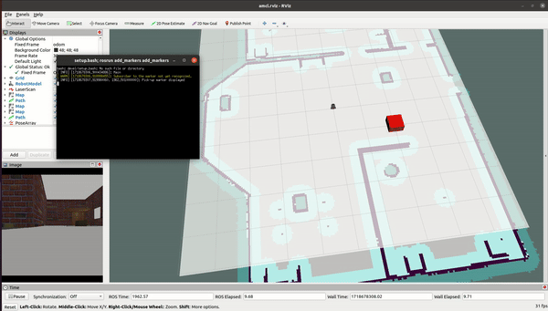

# Home Service Robot

This project aims to perform mapping using RGB-D based RTAB-Map (Real-Time Appearance-Based Mapping) Algorithm.


:--:
*Robot mapping the environment*

## Directory Tree 

```
.home-service-robot                                 # Home Service Robot Project
├── add_markers                                     # add markers package
│   ├── CMakeLists.txt
│   ├── package.xml
│   └── src
│       └── add_markers.cpp
├── assets                                          # simulation media
│   ├── robotworld.gif
│   └── robotworld.mp4
├── CMakeLists.txt
├── pick_objects                                    # pick objects package
│   ├── CMakeLists.txt
│   ├── package.xml
│   └── src
│       └── pick_objects.cpp
├── robot_world
│   ├── CMakeLists.txt
│   ├── config
│   │   ├── base_local_planner_params.yaml
│   │   ├── costmap_common_params.yaml
│   │   ├── global_costmap_params.yaml
│   │   ├── local_costmap_params.yaml
│   │   └── __MACOSX
│   ├── include
│   │   └── robot_world
│   ├── launch
│   │   ├── amcl.launch
│   │   ├── gmapping_demo.launch
│   │   ├── robot_description.launch
│   │   ├── smallworld.launch
│   │   └── view_navigation.launch
│   ├── maps
│   │   ├── world.pgm
│   │   └── world.yaml
│   ├── meshes                                      # meshes folder for sensors
│   │   ├── bases
│   │   │   └── burger_base.stl
│   │   ├── hokuyo.dae
│   │   ├── RpiCamera.stl
│   │   ├── sensors
│   │   │   ├── astra.dae
│   │   │   ├── astra.jpg
│   │   │   ├── lds.stl
│   │   │   ├── r200.dae
│   │   │   └── r200.jpg
│   │   └── wheels
│   │       ├── left_tire.stl
│   │       └── right_tire.stl
│   ├── package.xml
│   ├── rviz
│   │   └── amcl.rviz
│   ├── scripts
│   │   ├── add_markers.sh
│   │   ├── home_service.sh
│   │   ├── pick_objects.sh
│   │   ├── test_navigation.sh
│   │   └── test_slam.sh
│   ├── urdf
│   │   ├── common_properties.xacro
│   │   ├── my_robot.gazebo
│   │   └── turtlebot3_burger.urdf.xacro
│   └── worlds
│       └── smallworld.world
└── teleop_twist_keyboard

21 directories, 53 files
```

